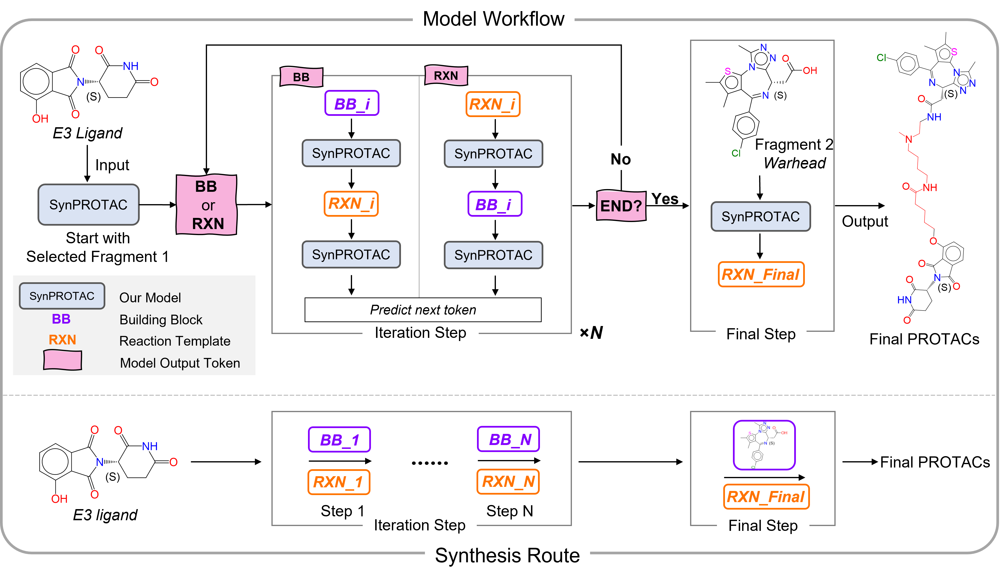

# SynPROTAC

SynPROTAC is a deep learning-based framework for the design of synthesizable PROTAC (Proteolysis Targeting Chimeras) molecules, integrating chemical reaction path-driven molecule assembly with reinforcement learning to optimize both synthetic accessibility and binding affinity.

## Features
- **Reaction-driven molecule assembly**: Generates PROTACs by sampling reaction templates and building blocks.
- **Reinforcement learning optimization**: Ensures generated molecules are both synthesizable and have favorable binding scores.
- **Transfer learning**: Enhances model performance for specific targets.
- **End-to-end synthetic route proposal**: Provides feasible synthetic routes for each designed PROTAC.
- **Experimental validation**: Successfully designed and synthesized PROTACs with nanomolar degradation activity against BRD4.

## Installation & Usage
coming soon

## License
[MIT License](LICENSE)
